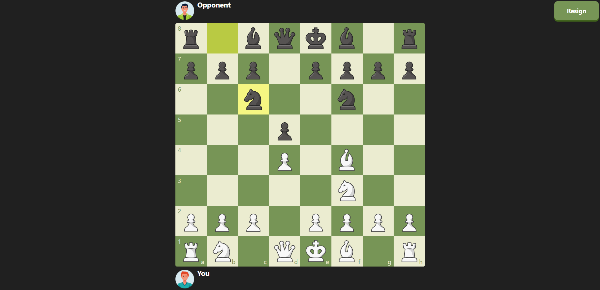

# Chess Wizard

Chess Wizard,built using Next.js and TypeScript, is designed to provide a seamless and customizable chess experience. What sets this application apart is that all chess rules, movements, and gameplay logic have been meticulously developed from scratch, without relying on any third-party libraries for the game's core functionality. This unique approach ensures complete control over every aspect of gameplay and offers an unparalleled chess experience.



<!-- TABLE OF CONTENTS -->
<details>
  <summary>Table of Contents</summary>
  <ol>
    <li>
      <a href="#about-the-project">About The Project</a>
      <ul>
        <li><a href="#built-with">Built With</a></li>
      </ul>
    </li>
    <li>
      <a href="#getting-started">Getting Started</a>
      <ul>
        <li><a href="#prerequisites">Prerequisites</a></li>
        <li><a href="#installation">Installation</a></li>
      </ul>
    </li>
    <li><a href="#features">Features</a></li>
    <li><a href="#contributing">Contributing</a></li>
    <li><a href="#license">License</a></li>
    <li><a href="#view-demo">View Demo</a></li>
    <li><a href="#contact">Contact</a></li>
  </ol>
</details>

### Built With

- [React](https://reactjs.org/)
- [NextJs](https://nextjs.org/)
- [Tailwind](https://tailwindcss.com/)

## Getting Started

### Prerequisites

Install [Nodejs](https://nodejs.org/en/) from the official site.

### Installation

_Follow the following steps to install and setup the virtual environment._

1. Clone the repo
   ```sh
   git clone https://github.com/Samrat-14/chess-wizard.git
   ```
2. Once inside the cloned repo, get started with installing the node modules.
   ```sh
   npm install
   ```
3. Start the server for frontend.
   ```sh
   npm run dev
   ```
4. After the installments are over and the server is running, you can get started with the project.

## Features

- **Custom Chess Engine:** All chess rules, including piece movements, castling, en passant, and pawn promotion, have been written from scratch, adhering to official FIDE standards.
- **Turn-based Logic:** Includes comprehensive handling of turns, checking for checkmate, stalemate, and draw conditions.
- **Move Validation:** Ensures valid movements for each piece, preventing illegal moves and offering dynamic feedback for missteps.
- **Responsive Design:** Optimized for desktop and mobile devices, ensuring the best experience across screen sizes.
- **Performance Optimized:** Written in TypeScript with efficient algorithms for move validation and game state management, ensuring high performance even for complex endgames.

## Contributing

I love contributions, so please feel free to fix bugs, improve things, provide documentation.
If you have a suggestion that would make this better, please fork the repo and create a pull request. You can also simply open an issue with the tag "enhancement".
Don't forget to give the project a star! Thanks again!

1. Fork the Project
2. Create your Feature Branch (`git checkout -b feature/AmazingFeature`)
3. Commit your Changes (`git commit -m 'Add some AmazingFeature'`)
4. Push to the Branch (`git push origin feature/AmazingFeature`)
5. Open a Pull Request

<!-- LICENSE -->

## License

Distributed under the MIT License. See `LICENSE` for more information.

## View Demo

Live Demo: [https://samrat-chess-wizard.vercel.app/](https://samrat-chess-wizard.vercel.app)

## Contact

Your Name - [Samrat Sadhu](https://samrat-sadhu-portfolio.vercel.app/) - ss2414@ece.jgec.ac.in
